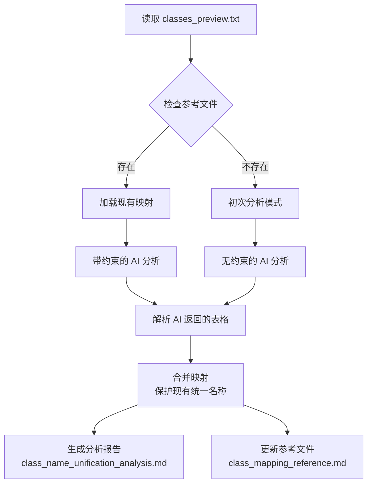

# analyze_classes.py - 类别名称分析与统一工具

## 概述

`analyze_classes.py` 是一个基于 Google Gemini AI 的类别名称分析工具，用于自动识别 YOLO 数据集中相似或重复的类别名称，并提供统一化建议。

## 主要功能

### 1. 智能分析类别变体
- 识别语意相同但写法不同的类别名称（如 "确定按钮"、"Confirm button"、"OK button"）
- 统计每个类别的变体数量
- 提供语意分析说明

### 2. 增量更新与映射保护
- 自动合并新类别分析结果与现有映射
- **保护现有统一名称**：已建立的映射不会被更改
- 新变体自动归类到对应的现有映射

### 3. 标准化规则
- **语言**：优先使用英文名称（避免中文或双语混用）
- **大小写**：采用 sentence case（如 "Dropdown menu"）
- **冲突解决**：选择最常出现的名称变体
- **中文系统名称**：无英文对应时保留中文原样

## 工作流程



## 文件结构

### 输入文件
- **classes_preview.txt**：待分析的类别名称列表（每行一个类别名称）
  ```
  确定 button
  Confirm
  OK button
  取消 Cancel
  ```

### 输出文件
1. **class_name_unification_analysis.md**：完整的 AI 分析报告
   - 包含时间戳、模型信息
   - 语意分析表格
   - 标准化规则说明

2. **class_mapping_reference.md**：增量更新的参考映射表
   - 按变体数量降序排序
   - 作为后续分析的约束条件
   - 保护已建立的统一名称

## 使用方式

### 前置条件

1. **环境依赖**
   ```bash
   pip install google-genai
   ```

2. **API 密钥设置**
   ```bash
   # 设置环境变量（二选一）
   export GOOGLE_API_KEY="your-api-key"
   export GEMINI_API_KEY="your-api-key"
   ```

### 基本使用

```bash
python analyze_classes.py
```

### 自定义配置

在脚本中修改 `main()` 函数的参数：

```python
def main():
    # 修改输入文件路径
    classes_file = Path("your/path/classes_preview.txt")
    
    # 修改输出目录
    output_file = classes_file.parent / "analysis_output.md"
    
    # 修改参考文件路径
    reference_file = Path("custom_reference.md")
```

## 核心机制说明

### 1. 错误处理与重试机制

脚本具备完善的错误处理策略：

- **500 INTERNAL 错误**：指数退避重试（5次，间隔递增）
- **503 高需求错误**：自动切换到备用模型（`gemma-4-26b-a4b-it`）
- **空结果处理**：抛出明确的运行时错误

```python
def generate_text_with_retry(
    api_key: str,
    model: str,
    contents,
    generate_content_config,
    max_attempts: int = 5,
    retry_delay_seconds: int = 5,
    fallback_model: str = "gemma-4-26b-a4b-it",
) -> str:
    # 自动重试与模型切换逻辑
```

### 2. 映射合并算法

保证数据一致性的核心逻辑：

```python
def merge_mappings(existing, new):
    # 1. 保留所有现有映射
    # 2. 建立原始名称 -> 统一名称的反向索引
    # 3. 新变体优先归类到现有映射
    # 4. 只有完全新的类别才创建新映射
    # 5. 避免重复：每个原始名称只出现一次
```

### 3. Prompt 工程

两种分析模式：

**带约束的分析**（有现有映射时）：
```
**重要约束（必须遵守）**：
以下是已存在的类别名称映射，建议统一名称不可更改：
- 确定 button, Confirm, OK button → **Confirm button**
- 取消, Cancel → **Cancel button**
...
```

**无约束的初始分析**（首次运行）：
```
分析以下类别名稱列表，找出哪些意思相同或相似...
```

### 4. 表格解析

从 AI 返回的 Markdown 内容中精确提取表格：

```python
def extract_table_from_result(result: str) -> str:
    # 识别表格边界
    # 提取完整表格行
    # 处理多行或嵌套表格
```

## 输出示例

### class_name_unification_analysis.md

```markdown
# Class Name Unification Analysis

Generated from: `classes_preview.txt`
Date: 2026-05-27 14:30:00
Model: gemma-4-31b-it

## Analysis Result

| 原始類別名稱 | 語意分析 | 建議統一名稱 | 變體數量 |
| :--- | :--- | :--- | :---: |
| 确定 button, Confirm, OK button, 確認按鈕 | 確認操作的按鈕 | Confirm button | 4 |
| 取消, Cancel, 取消按鈕 | 取消操作的按鈕 | Cancel button | 3 |
```

### class_mapping_reference.md

```markdown
# Class Name Mapping Reference

**Last Updated**: 2026-05-27 14:30:00  
**Source**: `classes_preview.txt`  
**Model**: gemma-4-31b-it

## Unified Class Name Mapping

| 原始類別名稱 | 語意分析 | 建議統一名稱 | 變體數量 |
| :--- | :--- | :--- | :---: |
| 确定 button, Confirm, OK button, 確認按鈕 | 確認操作的按鈕 | Confirm button | 4 |
| 取消, Cancel, 取消按鈕 | 取消操作的按鈕 | Cancel button | 3 |
```

## 常见问题

### Q1: API 调用失败怎么办？
**A**: 脚本已内置重试机制，会自动重试5次。如果持续失败，检查：
- API 密钥是否正确设置
- 网络连接是否正常
- API 配额是否充足

### Q2: 如何修改默认模型？
**A**: 修改脚本顶部的常量：
```python
DEFAULT_MODEL = "gemma-4-31b-it"  # 改为你想要的模型
```

### Q3: 现有映射被错误修改怎么办？
**A**: `merge_mappings()` 函数设计上**不会修改现有统一名称**。如果发现问题：
1. 检查 `class_mapping_reference.md` 的备份
2. 手动编辑参考文件恢复正确映射
3. 重新运行分析

### Q4: 分析结果为空？
**A**: 可能原因：
- `classes_preview.txt` 文件为空或格式错误
- AI 返回了非表格格式的内容
- 网络请求被中断

查看调试输出：
```
[DEBUG] Result length: 0 characters
```

### Q5: 如何批量分析多个文件？
**A**: 修改 `main()` 函数添加循环逻辑：
```python
def main():
    classes_files = [
        Path("recordings/dataset_1/classes_preview.txt"),
        Path("recordings/dataset_2/classes_preview.txt"),
    ]
    
    for classes_file in classes_files:
        output_file = classes_file.parent / "analysis.md"
        # ... 运行分析
```

## 技术细节

### API 配置

```python
def build_generate_content_config():
    return types.GenerateContentConfig(
        temperature=0.3,  # 低温度保证一致性
    )
```

### 调试信息

脚本提供详细的调试输出：
```
[INFO] Starting analysis...
[INFO] Found 12 existing mappings
[INFO] Analyzing 45 class names from classes_preview.txt...
[DEBUG] Attempt 1/5: Sending request to Gemini API...
[DEBUG] Received 5 chunks...
[DEBUG] Total chunks received: 23
[DEBUG] Result length: 2847 characters
[MERGE] Added variants to existing mapping: Confirm button
[MERGE] Created new mapping: Dropdown menu (3 variants)
[SUCCESS] Analysis saved to: class_name_unification_analysis.md
```

## 集成建议

### 1. 与自动标注流程整合

在 `auto_label_from_events.py` 中调用：
```python
from analyze_classes import analyze_class_names

# 自动标注完成后分析类别
result = analyze_class_names(
    classes_file="recordings/xxx/classes_preview.txt",
    reference_file=Path("class_mapping_reference.md")
)
```

### 2. CI/CD 集成

```yaml
# .github/workflows/analyze.yml
name: Analyze Class Names
on: [push]
jobs:
  analyze:
    runs-on: ubuntu-latest
    steps:
      - uses: actions/checkout@v2
      - name: Run analysis
        env:
          GOOGLE_API_KEY: ${{ secrets.GOOGLE_API_KEY }}
        run: python analyze_classes.py
```

### 3. 定期清理与审查

建议每周审查 `class_mapping_reference.md`：
- 检查是否有语意重复的统一名称
- 确认中英文混用情况
- 手动合并相似的映射

## 相关文件

- [class_mapping_reference.md](class_mapping_reference.md) - 当前的统一映射参考
- [auto_label_from_events.py](auto_label_from_events.py) - 自动标注主流程
- [auto_prepare_dataset.py](auto_prepare_dataset.py) - 数据集准备工具
